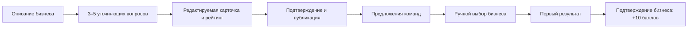
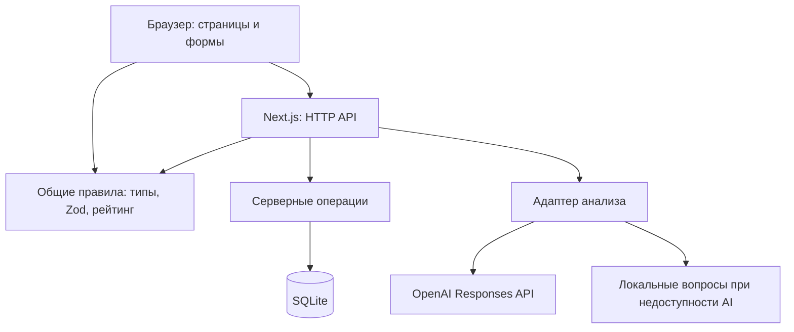

# SanaLink

### От бизнес-проблемы — к понятной задаче и первому результату

**SanaLink** помогает бизнесу сформулировать практическую задачу, а студенческим командам — найти проект и предложить решение. AI-помощник уточняет исходное описание, объяснимый рейтинг показывает полноту задачи, а бизнес вручную выбирает исполнителей и подтверждает результат.

Проект команды **Aimens** для HackAlem по кейсу **AI Sana**.

**Для проверки не нужны регистрация, API-ключ или отдельный сервер базы данных.** Весь основной сценарий доступен локально с синтетическими данными и явно обозначенным локальным помощником.

[Запуск](#установка-и-запуск) · [Сценарий для жюри](#как-проверить-решение) · [Архитектура](#архитектура) · [Ограничения](#ограничения)

## Какую проблему решаем

Бизнес часто описывает потребность одной фразой: «Не понимаем, сколько выпечки готовить завтра». Для начала работы команде не хватает контекста, данных, ограничений и критерия успеха. Уточнение затягивается, а сравнить задачи и предложения сложно.

SanaLink переводит такое описание в редактируемую карточку с понятным результатом. Бизнес получает предложения команд и сохраняет контроль над выбором. Студенты видят открытые задачи, предлагают свой подход и получают баллы за результат, подтверждённый заказчиком.

## Что реализовано

| Возможность | Что можно сделать в приложении |
| --- | --- |
| Конструктор задачи | Пройти четыре шага: черновик → уточнение → карточка → публикация |
| Помощник | Получить 3–5 уточняющих вопросов; с OpenAI — заполнить пустые поля сведениями из своего текста и увидеть источники |
| Редактирование и подтверждение | Исправить ответы, проверить полную карточку и вручную подтвердить публикацию |
| Объяснимый рейтинг | Увидеть готовность от 0 до 100, вклад каждого критерия и недостающие сведения |
| Открытый каталог | Искать задачи, фильтровать по теме, готовности и формату работы, менять сортировку и сохранять избранное |
| Предложения команд | Отправить идею, план, срок и ссылку на прототип; сравнить предложения и вручную выбрать одну или несколько команд |
| Первый результат | Отправить описание и ссылку, исправить их до подтверждения и получить **10 баллов** после подтверждения бизнесом |
| Кабинеты и демопрофили | Переключаться между бизнесом и пятью командами, видеть задачи, отклики, решения и баллы |
| Собственная команда | Создать демокоманду с названием, интересами и значком, затем отправлять предложения от её имени |
| Языки интерфейса | Переключать русский, казахский и английский; введённые пользователем тексты сохраняются на языке оригинала |
| Сохранение данных | Продолжить работу после перезапуска: карточки, предложения и результаты хранятся в SQLite |

Создать свою команду можно на `/teams/new`: укажите название, направления и один из десяти значков. Новый профиль сразу становится активным; переключение между бизнесом и командами доступно в меню справа. Язык выбирается в шапке и сохраняется в браузере.

## Как работает решение



AI помогает подготовить задачу. Публикацию, выбор команды и подтверждение результата выполняет человек. Все опубликованные задачи доступны каждой команде; низкая готовность не блокирует публикацию или отклик.

### Два разных показателя

**Готовность задачи — 0–100.** Это полнота подтверждённой карточки, а не оценка компании или качества будущего решения. Единая функция `computeReadiness(card)` используется для предварительного показа и серверного пересчёта.

| Критерий | Баллы |
| --- | ---: |
| Контекст | 10 |
| Потребность | 10 |
| Данные **и способ доступа к ним** | 20 |
| Ожидаемый результат | 15 |
| Показатель успеха **и целевое значение** | 15 |
| Ограничения | 10 |
| Пользователи | 10 |
| Контакт | 5 |
| Формат взаимодействия с бизнесом | 5 |
| **Итого** | **100** |

Каждый критерий даёт полный вес или 0. Пустые значения не учитываются; отсутствие данных или способа доступа даёт 0 за данные. Название, тема, навыки и место работы баллы не добавляют.

| 0–39 | 40–69 | 70–89 | 90–100 |
| --- | --- | --- | --- |
| Черновик | Рабочая | Готовая | Приоритетная |

До подтверждения рейтинг в редакторе предварительный. Для публикации достаточно названия, темы и явного подтверждения. Неподтверждённые правки не меняют публичную карточку. Каталог по умолчанию сортируется по убыванию готовности, затем по более ранней публикации и идентификатору.

**Баллы команды — за подтверждённый результат.** Отклик и выбор команды баллов не дают. Первый результат приносит **10 баллов один раз для пары «задача — команда»**. Повторное подтверждение и несколько предложений одной команды не увеличивают награду. Число предложений не ограничено; выбор одной команды не отклоняет остальные.

## Технологии

| Слой | Технологии |
| --- | --- |
| Язык и интерфейс | TypeScript, React 19, Next.js 16 App Router |
| Стили и графика | Tailwind CSS 4, CSS Modules, Lucide, локальный DM Sans и SVG/PNG |
| Сервер | Node.js **24.x**, HTTP-обработчики Next.js в Node runtime |
| Валидация | Zod |
| Хранение | SQLite через встроенный `node:sqlite`, без ORM |
| AI | OpenAI SDK, Responses API, Structured Outputs; модель по умолчанию `gpt-4.1-mini-2025-04-14` |
| Проверки | Vitest, Playwright, ESLint, TypeScript |

Точные версии зависимостей зафиксированы в `package-lock.json`; `npm ci` устанавливает их без пересчёта. Исходники создавались с помощью Codex. OpenAI — единственный необязательный внешний сервис анализа.

## Архитектура

Один Node.js процесс обслуживает интерфейс и API. Отдельный backend, сервер базы данных и очередь задач для запуска не нужны.



```text
src/
  app/                     страницы, HTTP API и общие стили
  components/              каталог, кабинеты, предложения и рейтинг
    task-builder/          четыре шага конструктора и состояние формы
  domain/                  типы, валидация, рейтинг и демоданные
  server/                  SQLite, бизнес-операции и адаптер AI
public/assets/             локальные изображения
scripts/                   проверка production-запуска и экспорт графики
tests/                     модульные, серверные и браузерные тесты
docs/                      подробные контракты и сценарий демонстрации
```

Основные сущности: `Task` — задача, `Team` — команда, `Proposal` — предложение, `Progress` — первый результат. API: `GET /api/demo` возвращает данные текущего демопрофиля, `POST /api/demo` выполняет действия, `POST /api/analyze` анализирует описание. Сервер проверяет входные данные и пересчитывает рейтинг; готовый балл от клиента не принимается как источник истины.

Подробнее: [архитектура и HTTP-контракт](docs/ARCHITECTURE.md).

Дополнительно `POST /api/suggest-topic` предлагает одно из 12 направлений, а `POST /api/review-task` возвращает необязательные рекомендации по содержанию. Эта отдельная оценка не влияет на рейтинг готовности, каталог или возможность публикации.

## Установка и запуск

### 1. Подготовьте окружение

Нужны **Node.js 24.x**, npm и Git. В проекте указан npm **11.17.0**. Проверьте установленную версию Node:

```sh
node --version
npm --version
```

### 2. Скачайте проект и установите зависимости

```sh
git clone --branch main https://github.com/BAITC-Hacks/hack-0ae2732e-aimens.git
cd hack-0ae2732e-aimens
npm ci
```

Команда клонирования выбирает ветку с текущей реализацией. Интернет нужен для скачивания проекта и зависимостей.

### 3. Запустите приложение

```sh
npm run dev
```

Откройте **[http://127.0.0.1:3000](http://127.0.0.1:3000)**. Без `.env.local` и API-ключа автоматически включается локальный помощник. После установки зависимостей основной сценарий работает без интернета; шрифты и изображения находятся в проекте.

SQLite создаётся автоматически в `data/praktika.sqlite`. Начальные записи добавляются без дублирования и без перезаписи пользовательских изменений. Не удаляйте файл базы, если хотите сохранить результаты проверки.

Если порт 3000 занят:

```sh
npm run dev -- --port 3001
```

В этом случае откройте `http://127.0.0.1:3001`.

### Production-запуск

Остановите dev-сервер и выполните:

```sh
npm run build
npm start
```

Адрес по умолчанию тот же: `http://127.0.0.1:3000`.

### Подключение OpenAI — необязательно

Скопируйте `.env.example` в `.env.local`:

```powershell
# Windows PowerShell
Copy-Item .env.example .env.local
```

```sh
# macOS / Linux
cp .env.example .env.local
```

Заполните `OPENAI_API_KEY` в `.env.local` и перезапустите сервер.

| Переменная | По умолчанию | Назначение |
| --- | --- | --- |
| `AI_MODE` | `auto` | `local` принудительно включает локальный режим |
| `OPENAI_API_KEY` | Пусто | Серверный ключ OpenAI |
| `OPENAI_MODEL` | `gpt-4.1-mini-2025-04-14` | Модель для анализа |
| `DATABASE_PATH` | `data/praktika.sqlite` | Путь к сохраняемой базе |

Ключ не передаётся браузеру; `.env.local` исключён из Git. Реальные ключи нельзя добавлять в репозиторий.

## Как проверить решение

### Основной сценарий для жюри — около пяти минут

**1. Опишите проблему.** В режиме **«Бизнес»** нажмите **«Разместить задачу»**, выберите тему «Торговля» и введите:

> У нас сеть кофеен. Каждый вечер остаётся выпечка, и мы не понимаем, сколько готовить завтра.

Нажмите **«Помочь с описанием»**. Появятся 3–5 вопросов и подпись режима анализа. Без ключа это локальный помощник; он задаёт вопросы, но не генерирует ответы.

**2. Подготовьте карточку.** Ответьте на вопросы и нажмите **«Перейти к карточке»**. Для воспроизводимой проверки используйте следующие синтетические сведения:

| Поле | Пример значения |
| --- | --- |
| Название | Снизить списания выпечки в сети кофеен |
| Контекст | Каждый вечер остаётся непроданная выпечка |
| Потребность | Точнее планировать производство на завтра |
| Пользователи | Управляющие кофейнями |
| Данные | Таблица продаж и списаний за три месяца |
| Доступ к данным | Будут предоставлены |
| Ожидаемый результат | Прототип расчёта объёма выпечки на следующий день |
| Показатель успеха | Доля списанной выпечки |
| Целевое значение | Снизить на 20% на тестовой выборке |
| Ограничения | Только синтетические данные, без кассовых интеграций |
| Контакт | demo@example.com |
| Взаимодействие | Консультация раз в неделю |

**Ожидается:** ответы редактируются, рейтинг меняется при заполнении. Все девять критериев дают **100/100**. Данные вместе с доступом добавляют 20 баллов, показатель вместе с целью — 15.

**3. Опубликуйте задачу.** Нажмите **«Предпросмотр»**, отметьте проверку сведений, затем **«Подтвердить карточку» → «Опубликовать задачу»**. Найдите публикацию в каталоге.

**4. Отправьте предложение.** Переключитесь в режим **«Студент»** и выберите **Qyran Lab** в меню профиля. Откройте созданную задачу и отправьте:

- **Идея:** прогноз спроса по истории продаж.
- **План:** изучить таблицу, собрать базовый прогноз, проверить с бизнесом.
- **Срок:** две недели.
- **Ссылка на прототип:** `https://example.com/prototype`.

**5. Выберите команду.** Вернитесь в режим **«Бизнес»** и нажмите **«Выбрать команду»** у предложения. На этом этапе баллы команды не меняются.

**6. Подтвердите результат.** В режиме Qyran Lab отправьте первый результат: «Подготовлен прототип прогноза по синтетическим данным», ссылка `https://example.com/result`. Вернитесь в бизнес и нажмите **«Подтвердить результат · +10»**.

**Ожидается:** у команды стало на **10 баллов больше**. Повторное подтверждение той же пары «задача — команда» не даёт дополнительную награду. Ссылки `example.com` нужны для проверки формы и не ведут на настоящий прототип.

**Проверка сохранения:** запомните URL задачи, остановите сервер и запустите его снова с тем же `DATABASE_PATH`. Карточка, предложение, результат и баллы должны сохраниться.

[Подробный сценарий демонстрации](docs/DEMO.md).

### Автоматические проверки

После `npm ci` выполните:

```sh
npm test
npm run typecheck
npm run lint
npx playwright install chromium
npm run test:e2e
npm run build
npm run test:production
```

| Проверка | Что проверяет |
| --- | --- |
| `npm test` | Формулу и границы рейтинга, правила публикации, предложения, начисление баллов, AI-валидацию и серверные операции |
| `npm run typecheck` / `npm run lint` | Типы и статический анализ кода |
| `npm run test:e2e` | Пользовательские сценарии в реальном браузере, включая полный путь и работу конструктора |
| `npm run build` | Сборку приложения для production |
| `npm run test:production` | HTTP-сценарий без ключа, реальный перезапуск сервера, сохранность SQLite и защиту от повторного начисления |

Playwright использует порт **3100**, локальный AI и отдельную временную базу. Порт должен быть свободен. Production-проверка также создаёт временную базу; рабочие данные не затрагиваются.

**Итоговая версия проверена 23 сентября 2026 в чистой копии**, без `.env.local`, API-ключа и рабочей базы; Node.js 24.18.0 / npm 11.17.0.

| Команда | Результат |
| --- | --- |
| `npm ci` | Установка по lockfile успешна |
| `npm test` | **87 тестов прошли** |
| `npm run test:e2e` | **38 сценариев прошли**, Chromium; полный прогон около 2 минут |
| `npm run build` | Production-сборка успешна |
| `npm run typecheck`, `npm run lint` | Без ошибок |
| `npm run test:production` | Полный путь без ключа, публикация при нулевом рейтинге, независимость AI-рекомендаций, перезапуск и однократные +10 баллов |

В автоматических тестах внешних AI-ответов используется подмена; доступность реального OpenAI API проверяется отдельно. [Состав итогового объединения веток](docs/INTEGRATION.md).

## Данные и интеграции

### Демоданные

На свежей базе автоматически создаются **5 исходных черновиков, 5 опубликованных задач, 5 команд и 5 предложений**. Опубликованные задачи имеют готовность **100 / 90 / 75 / 55 / 20**, чтобы можно было проверить разные уровни и фильтры. Черновики доступны бизнесу, скрыты от каталога и имеют официальный рейтинг 0.

Все организации, задачи и контакты синтетические. Темы примеров: кофейня, образование, доставка, склад и отзывы клиентов. Внешних датасетов и интеграций с системами бизнеса нет. Повторный запуск сохраняет пользовательские записи; после редактирования исходные количества и рейтинги могут измениться.

### AI-анализ

В OpenAI передаются исходное описание, тема и уже введённые сведения. Сервер запрашивает структурированный ответ, проверяет его через Zod и принимает извлечённое значение только при дословном совпадении с фрагментом пользовательского ввода. Пустые поля заполняются автоматически; источники видны рядом, ответы можно исправить. Кнопка **«Заполнить с ИИ»** доступна над вопросами и у текстовых полей карточки. Введённые ответы не перезаписываются.

Если ключ отсутствует, API недоступен, превышен тайм-аут **20 секунд**, получен отказ или некорректный ответ, приложение явно включает **локальный режим**. Он определяет пробелы правилами и задаёт вопросы по текущему вводу, без внешней модели и без выдуманных ответов. Ошибка анализа не очищает форму. Для внешнего запроса используется `store: false`.

[Промпт, формат входа/выхода и пример некорректного ответа](docs/AI_PROMPT.md).

## Ограничения

- **Демонстрационные роли вместо регистрации.** Один демобизнес управляет задачами; переключатель профиля не проверяет личность. Для публичной эксплуатации нужны аутентификация и разделение владельцев.
- **Один сервер с локальной SQLite.** Распределённое развёртывание, масштабирование и production-инфраструктура не реализованы; нужен сохраняемый диск.
- **AI ограничен исходным текстом.** Он не проверяет истинность фактов и не гарантирует смысловую уместность цитаты. Карточку проверяет человек. Локальный режим задаёт вопросы, но не выполняет AI-автозаполнение.
- **Локализация интерфейса использует словари.** Пользовательские данные и свободные ответы AI автоматически не переводятся; отдельные новые формулировки могут оставаться на русском.
- **Нет загрузки файлов и бизнес-интеграций.** Прототип и результат представлены текстом и ссылкой. Чат, уведомления, календарь и сложный трекер не входят в MVP.
- **Несохранённая форма теряется при перезагрузке.** Для продолжения работы используйте «Сохранить черновик». Сохранённые данные остаются в SQLite, избранное — в браузере.
- **Решения по предложению окончательны.** Выбор или отклонение нельзя отменить; первый результат редактируется только до подтверждения бизнесом.

## Развёрнутая версия

Подтверждённая ссылка на публичную deployed-версию в репозитории не указана. Для оценки используйте локальный запуск по инструкции выше.

**Репозиторий:** [BAITC-Hacks / hack-0ae2732e-aimens](https://github.com/BAITC-Hacks/hack-0ae2732e-aimens/tree/main).
