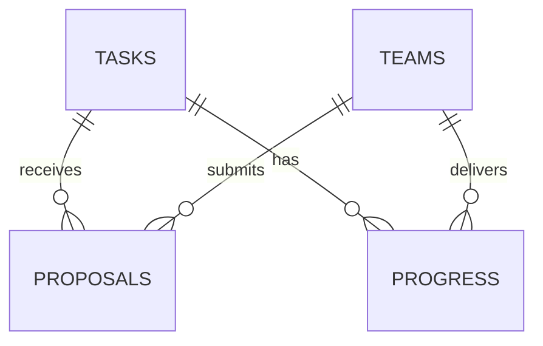

# Архитектура SanaLink

## Решения и границы

Существующий стек сохранён: Next.js App Router, React, TypeScript, Tailwind CSS, Zod и `node:sqlite`. Один Node.js процесс обслуживает страницы и API; SQLite сохраняет данные между перезапусками. Это позволяет демонстрировать весь путь без отдельного сервиса БД и личных аккаунтов.

| Модуль | Ответственность |
| --- | --- |
| `src/domain/task.ts` | `Card`, `Task`, `Team`, `Proposal`, `Progress`, Zod-схемы и единая формула `computeReadiness` |
| `src/domain/catalog.ts` | Поиск, фильтры, сортировка; отдельная объяснимая подборка по интересам и навыкам |
| `src/domain/demo-data.ts` | Пять исходных черновиков, пять опубликованных карточек и пять команд |
| `src/server/store.ts` | SQLite, идемпотентные демоданные, права деморолей и операции над задачами/предложениями/результатами |
| `src/server/ai.ts` | Промпт, Responses API, проверка цитат, устранение повторных вопросов, локальный режим и лимит частоты |
| `src/server/http.ts`, `src/app/api/` | Потоковый лимит тела POST, Node.js обработчики, валидация и ответы об ошибках |
| `src/components/demo-provider.tsx` | Демороль с восстановлением в пределах вкладки, серверный снимок, действия и сообщения |
| `src/components/task-builder/` | Четыре этапа конструктора; редактируемый локальный ввод, подтверждение и сохранение |
| `src/components/favorites.tsx` | Избранное в браузере отдельно для каждого демопрофиля |
| `src/components/proposal-comparison.tsx` | Сопоставление предложений по команде, идее, плану, сроку, ссылке и статусу |
| `src/assets/svg/`, `scripts/export-assets.mjs` | Исходная векторная графика и воспроизводимый экспорт публичных SVG/PNG |

Главная `/` знакомит с площадкой; `/catalog` содержит полный каталог. Конструктор `/tasks/new`, карточка `/tasks/[id]` и редактор `/tasks/[id]/edit` связаны с кабинетами `/business` и `/team`. `/teams` показывает команды, `/guide` объясняет правила.

## Схема данных

- `tasks`: идентификатор, JSON карточки, исходное описание, компания, даты создания, подтверждения и публикации. В демо владелец всех задач — единый профиль бизнеса.
- `teams`: идентификатор и JSON синтетического профиля, включая навыки и интересы.
- `proposals`: задача, команда, идея, план, срок, ссылка, статус и дата. Несколько предложений одной команды разрешены.
- `progress`: задача, команда, описание, ссылка, даты отправки и подтверждения. `UNIQUE(task_id, team_id)` защищает единственный первый результат.

Счёт команды вычисляется как количество подтверждённых строк `progress` × 10; отдельного изменяемого баланса нет. Подтверждение выполняется атомарным `UPDATE ... WHERE confirmed_at IS NULL`, поэтому повторный запрос новых баллов не создаёт.

Вкладка результатов бизнеса показывает по одной записи на пару «задача — команда», независимо от числа выбранных предложений этой команды. Выбор и отклонение сохраняются отдельно для каждого предложения.

SQLite работает с `foreign_keys=ON` и журналом WAL. Начальные записи добавляются транзакцией через `INSERT OR IGNORE`; повторный запуск не стирает пользовательские записи. Рабочий путь — `data/praktika.sqlite`, переопределение — серверная переменная `DATABASE_PATH`.

В свежей базе пять черновиков с собственными стабильными ID, темой и исходным текстом, пять опубликованных карточек, пять команд и пять предложений. У черновиков `confirmed_at` и `published_at` равны `NULL`, официальный рейтинг — 0. Бизнес видит все свои записи, команды и каталог — только опубликованные. Повторная инициализация не перезаписывает отредактированные или опубликованные пользователем черновики.

Метаданные `Card.workFormat` (`remote`, `hybrid`, `onsite`, `unspecified`) и `Card.skills` используются для каталога и подбора. Они не входят в рейтинг. Zod задаёт значения по умолчанию для старых карточек; таблицы и история подтверждения сохраняются.

## Серверный контракт

JSON-входы проверяются Zod; тело POST-запроса ограничено 65 000 байтами при чтении потока. `/api/analyze` дополнительно ограничен 20 запросами в минуту на клиента в памяти процесса. Демороль задаётся заголовком `x-demo-actor`: `business` или `team-1`…`team-5`. Этот заголовок моделирует поведение ролей, аутентификации в MVP нет.

| Метод и маршрут | Назначение |
| --- | --- |
| `GET /api/demo` | Снимок задач, команд, предложений и результатов для текущей роли |
| `POST /api/demo` | Выполнение действия; возврат идентификатора изменённой сущности |
| `POST /api/analyze` | `{ description, card }` → проверенные предложения полей и вопросы |

| `type` действия | Дополнительные поля | Роль |
| --- | --- | --- |
| `save-task` | `id?`, `card`, `rawDescription`, `confirmed`, `publish` | Бизнес |
| `propose` | `taskId`, `idea`, `plan`, `duration`, `link` | Команда |
| `decide` | `proposalId`, `status: selected / rejected` | Бизнес |
| `submit-progress` | `taskId`, `description`, `link` | Выбранная команда |
| `confirm-progress` | `progressId` | Бизнес |

Полный контракт действий — `actionSchema` в `src/domain/task.ts`. Ошибки `/api/demo`: 400 — правило сценария или неверный JSON, 403 — действие чужой роли, 404 — запись отсутствует, 422 — неверный формат полей, 413 — слишком большой запрос, 500 — внутренняя ошибка без раскрытия подробностей. `/api/analyze` возвращает 422 для неверного ввода; сбой внешней модели возвращает корректный ответ локального помощника.

SQL-значения передаются параметрами. Пользовательский текст выводится обычным React-текстом; ссылки ограничены HTTP(S). Серверный ключ OpenAI и файл SQLite не отправляются в браузер.

## Редактирование и подтверждение

Конструктор: **Черновик → Уточнение → Карточка → Публикация**. «Предпросмотр» переводит на четвёртый этап с полной карточкой. Пользователь отмечает проверку сведений и нажимает «Подтвердить карточку». Только затем доступна публикация. Любая правка сбрасывает подтверждение.

Текст формы и предварительный рейтинг существуют в локальном состоянии до сохранения. «Сохранить черновик» сохраняет неподтверждённую карточку и переводит в кабинет бизнеса; официальный рейтинг такого черновика равен 0. Подтверждение на этапе предпросмотра само по себе не публикует и не записывает карточку.

Публикация отправляет подтверждённые поля одним действием. Для уже опубликованной задачи сервер запрещает неподтверждённое сохранение. Карточка и дата подтверждения записываются вместе, а рейтинг сервер вычисляет из сохранённых полей. Порог готовности не ограничивает публикацию. Снятие с публикации не входит в MVP.

Ответ модели дополняет только пустые поля проверенными цитатами. Ошибка API оставляет введённый текст в форме. Контракт и fallback описаны в [AI_PROMPT.md](AI_PROMPT.md).

## Каталог, подборки и избранное

`filterCatalog` оставляет только опубликованные задачи. Поиск проверяет все слова запроса в компании, названии, теме, контексте, потребности, результате и навыках. Текст нормализуется через Unicode NFKC, нижний регистр и обрезку пробелов.

Сортировка по умолчанию: рейтинг по убыванию, затем более ранняя публикация, затем идентификатор. Пользователь может переключить представление на новые/старые публикации. Тема, уровень и место работы — фильтры представления; низкая готовность не ограничивает доступ.

`recommendTasks` создаёт отдельную подборку для выбранной команды. Совпадение темы с интересами даёт 2 единицы внутреннего показателя совпадений, каждый уникальный совпавший навык — 1. Навыки команды включают технологии. При равенстве применяется порядок полного каталога. Показатель совпадений не влияет на готовность, доступ к задачам, выбор бизнеса или баллы команды.

Избранное хранится под ключом `sanalink-favorites` в `localStorage` как карта «демопрофиль → идентификаторы задач». Серверное состояние не зависит от доступности хранилища браузера. При повреждении или блокировке хранилища избранное работает в памяти.

## Проверки и ограничения

Vitest покрывает доменные правила, серверные операции, AI-валидацию и сохранность данных. Playwright запускает отдельное приложение на порту 3100, с локальным AI и временной БД; рабочую базу не использует. Команды перечислены в [README](../README.md), сценарий ручной проверки — в [DEMO.md](DEMO.md). Наличие описания теста не заменяет успешный запуск.

Проект использует один локальный сервер. Нет настоящих аккаунтов, отдельных владельцев бизнеса, загрузки файлов, чата и production-инфраструктуры. Текущий демопрофиль восстанавливается после перезагрузки той же вкладки, несохранённый редактор теряется. Сохранённые карточки и результаты остаются в SQLite, избранное сохраняется в браузере. Демозаголовок не обеспечивает защиту от подмены личности и не подходит для публичной эксплуатации. Тесты внешнего адаптера используют подмену SDK; отдельный реальный запрос и итоговые проверки описаны в [README](../README.md).
