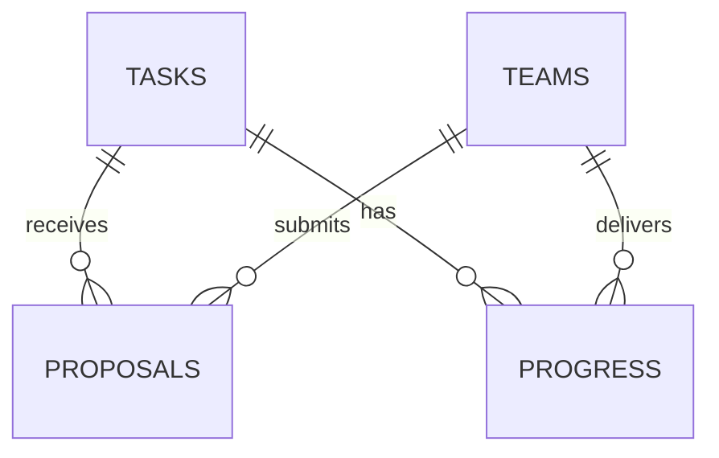

# Архитектура демо

## Границы модулей

- `src/domain/task.ts`: поля карточки, Zod-входы, типы и детерминированная формула рейтинга. Не зависит от Next.js или базы.
- `src/domain/demo-data.ts`: пять описаний, пять карточек и пять команд. Предложения создаются при начальной инициализации.
- `src/server/store.ts`: SQLite, начальные данные и операции. Проверяет демороль, принадлежность отклика и выбор команды. Все значения в SQL передаются параметрами.
- `src/server/ai.ts`: промпт, структурированный ответ, проверка цитат, локальные вопросы. Ключ не импортируется клиентскими компонентами.
- `src/app/api/`: тонкие Node.js HTTP-обработчики; Zod-ошибки и ожидаемые ошибки операций превращаются в понятные ответы.
- `src/components/demo-provider.tsx`: переключение профиля, загрузка снимка, отправка действий и сообщения об ошибках. Общего сложного хранилища состояния нет.
- `src/app/`: страницы. Состояние редактора локально; сервер получает карточку только при явном сохранении.

## Схема данных

`tasks`: идентификатор, JSON карточки, исходное описание, компания, даты создания/подтверждения/публикации. В демо владелец всех задач — единый профиль бизнеса.

`teams`: идентификатор и JSON публичного синтетического профиля.

`proposals`: задача, команда, идея, план, срок, ссылка, статус и дата. Повторные предложения разрешены, уникальности по паре здесь нет.

`progress`: задача, команда, описание, ссылка, даты отправки и подтверждения. Ограничение `UNIQUE(task_id, team_id)` защищает единственный этап. Баланс — число подтверждённых строк × 10; отдельного изменяемого счётчика нет.

База включена в WAL-режиме, внешние ключи включены. Начальные записи добавляются в транзакции через `INSERT OR IGNORE`. Подтверждение этапа — один атомарный `UPDATE ... WHERE confirmed_at IS NULL`, поэтому повторный запрос не увеличивает награду.

## HTTP-контракт

Все JSON-входы проверяются Zod; тело запроса ограничено 65 000 символами. Демороль задаётся заголовком `x-demo-actor`: `business` или `team-1`…`team-5`. Заголовок не является защитой входа; сервер предназначен для локального демо.

| Метод и маршрут | Назначение |
| --- | --- |
| `GET /api/demo` | Снимок задач, команд, предложений и результатов для текущей роли |
| `POST /api/demo` | Действие из таблицы ниже; возвращает идентификатор изменённой сущности |
| `POST /api/analyze` | `{ description, card }` → проверенные предложения полей и вопросы |

| `type` действия | Дополнительные поля | Роль |
| --- | --- | --- |
| `save-task` | `id?`, `card`, `rawDescription`, `confirmed`, `publish` | Бизнес |
| `propose` | `taskId`, `idea`, `plan`, `duration`, `link` | Команда |
| `decide` | `proposalId`, `status: selected / rejected` | Бизнес |
| `submit-progress` | `taskId`, `description`, `link` | Выбранная команда |
| `confirm-progress` | `progressId` | Бизнес |

Общие ошибки: 400 — правило сценария или неверный JSON, 403 — действие чужой роли, 404 — запись отсутствует, 422 — неверный формат полей, 413 — слишком большой запрос, 500 — внутренняя ошибка без раскрытия деталей. Полный тип входа — `actionSchema`, а не дублирующая схема в интерфейсе.

## Публикация и подтверждение

Поля формы свободно редактируются, а рейтинг справа предварительный. Несохранённые правки не уходят на сервер. Для опубликованной карточки сервер отклоняет сохранение без подтверждения. При сохранении карточка и дата подтверждения записываются одним SQL-выражением; рейтинг снимка вычисляется из этих полей.

Черновик можно сохранить без подтверждения: он виден только бизнесу и имеет официальный рейтинг 0. Подтверждённый черновик тоже может оставаться неопубликованным. Снятие опубликованной задачи с публикации не входит в демо.

## Ограничения

Одна локальная база и один сервер, без аккаунтов, разграничения нескольких бизнесов и производственной миграционной системы. Выбор демопрофиля хранится в состоянии интерфейса и сбрасывается при полной перезагрузке. SQLite и ключ не передаются в браузер. Ввод отображается обычным React-текстом, ссылки ограничены HTTP(S).
